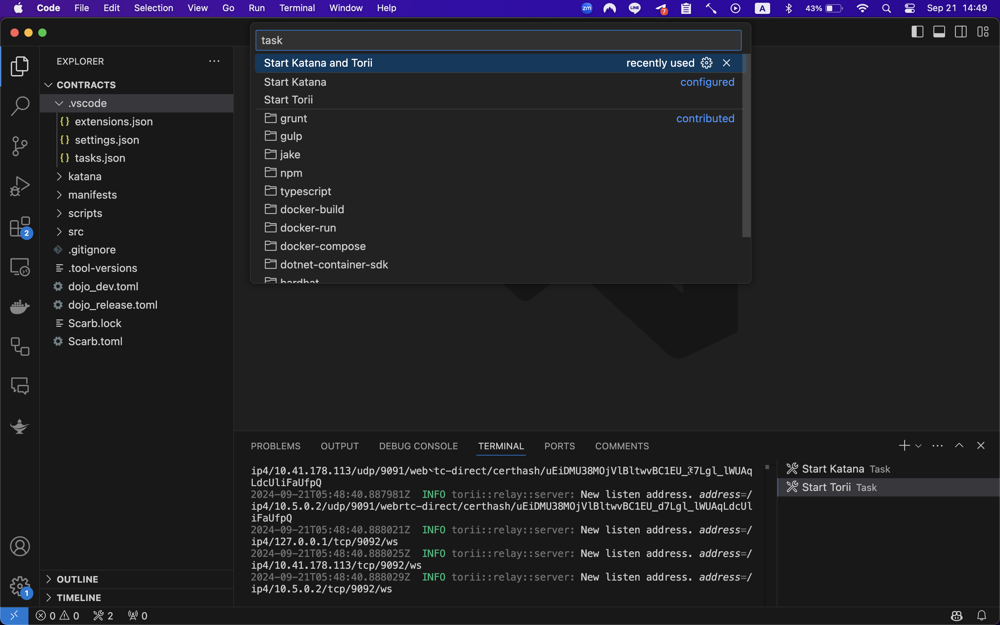

<picture>
<source media="(prefers-color-scheme: dark)" srcset="https://avatars.githubusercontent.com/u/140254228?s=200&v=4">  

</picture>

<a href="https://x.com/0xpixelaw">

</a>
<a href="https://github.com/pixelaw/core">

</a>

[](https://t.co/jKDjNbFdZ5)

# p/war

Contracts written in Cairo using Dojo to showcase a Pixel World with app interoperability. Its interoperability is made possible with core actions. Apps are any other contracts that are deployed to the Pixel World.

## Prerequisites

- [asdf](https://asdf-vm.com/)
- [scarb](https://docs.swmansion.com/scarb/)
- [dojo](https://github.com/dojoengine/dojo)

## Install asdf

Follow the asdf installation instructions.

## Install dojo

```
asdf plugin add dojo https://github.com/dojoengine/asdf-dojo
asdf install dojo 1.0.0-alpha.11
```

## Install scarb

```
asdf plugin add scarb
asdf install scarb 2.7.0
```

And after moving into contracts directory, the versions for these libs are set in the .tool-versions file.

## Running Locally

If you use vscode, you can start katana and torii just press `⌘ + ⇧ + B` in your vscode. This can be executed by selecting commands here:


If you use these shortcut, please check out if the contract was deployed.

otherwise,

#### Terminal one (Make sure this is running)

```bash
# Run Katana
katana --allowed-origins "*" --db-dir katana
```

#### Terminal two

```bash
# Build the example
sozo build

# Migrate the example
sozo migrate apply

# Start Torii
torii --world 0x2bf4d3aa0dced89d37d8c3b4ff6a05895c0af32ff3baf9b02abf8504e53eaad --allowed-origins "*"
```

### How to deploy

you can deploy your app to our katana testnet by running the following commands:

```bash
# Deploy the pixelaw app
sozo build -P release
sozo migrate apply -P release
```

### Setup Client

After finishing setup a contract side, you can run the client locally by following commands: 
```bash
cd ./client
bun install
bun run dev
```

## Troubleshooting

If you want to use latest dojo version, you need to clone core by yourself and modify the path in `Scarb.toml` file.

1. Clone core repo

```bash
git clone https://github.com/pixelaw/core
```

2. Modify the path in `Scarb.toml` file

```Scarb.toml
pixelaw = { path = "../pixelaw/core/contracts" }
```

3. Modify version in `Scarb.toml` file in core repo

```Scarb.toml
dojo = { git = "https://github.com/dojoengine/dojo", tag = "v1.0.0-alpha.11" }
```

4. Build and run core

```bash
cd contracts
sozo build
sozo migrate apply
```
